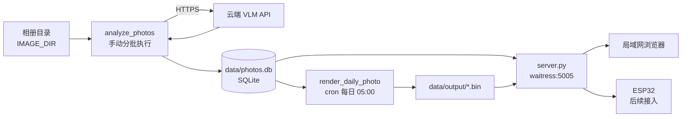
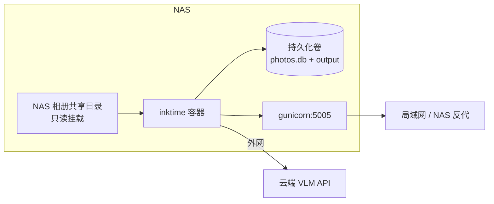

# InkTime 局域网常驻部署方案

> 本文档为执行手册。每个步骤都附带验证方法，按顺序执行，验证不通过不要进入下一步。
> 状态标记：`[ ]` 待执行 / `[x]` 已完成 / `[!]` 阻塞

---

## 一、背景与目标

### 1.1 项目是什么

InkTime 是墨水屏电子相框项目，由三个独立环节组成：

1. **照片分析**（`src/analysis/`）：扫描相册目录 → 调用视觉大模型（VLM）→ 生成画面描述、照片类型、值得回忆度评分、美观度评分、一句话文案 → 写入 SQLite
2. **图片渲染**（`src/render/`）：从库里挑「历史上的今天」高分照片 → 渲染成 480x800 四色墨水屏 `.bin`
3. **Web 服务**（`src/server/`）：提供照片浏览 WebUI + ESP32 拉取 `.bin` 的下载接口

### 1.2 本次要做什么

分两阶段落地：

- **阶段一（本机 venv + systemd）**：在当前 Linux 机器上跑通全流程并常驻，仅局域网访问，验证云模型通路与选片效果
- **阶段二（NAS Docker）**：迁移到家里 NAS 的 Docker 中运行，照片直接从 NAS 存储读取，模型仍调用外部云端 API

### 1.3 已确认的需求

| 项目 | 结论 |
|---|---|
| 照片量级 | 千级（约 1000–9999 张） |
| 相册路径 | **待提供** |
| VLM 来源 | 阶段一用公司小米大模型平台（内网），阶段二换公网商业 API（详见 4.1） |
| 访问范围 | 仅局域网，不暴露公网，单人使用 |
| 是否需要登录 | 不需要 |
| 配置方式 | **统一到单一 `.env` 文件**，不再使用 `config/config.py` |
| Docker | 分两步走，阶段二部署到 NAS |
| ESP32 硬件 | 本次不涉及（先只跑服务端，硬件后续接入） |

### 1.4 关键设计约束

**照片文件不入库，数据库存的是照片绝对路径。** `photo_scores.path` 字段是唯一约束，`server.py` 的 `/api/photo/full` 直接按该路径读原图。这带来两条硬性约束：

- 入库后不能挪动照片目录，否则全库图片 404
- 阶段二进 Docker 时，容器内的照片挂载路径必须与入库时的路径一致，否则同样全挂

应对方案见 [5.1 路径一致性策略](#51-路径一致性策略)。

---

## 二、现状盘点（阶段一必须先处理的问题）

代码已通读，下列问题会直接挡住部署，按优先级排列。

### 2.1 配置三套并存，且都不可用

| 文件 | 当前配置来源 | 问题 |
|---|---|---|
| `src/analysis/analyze_photos.py` | `import config as cfg` | 需要 `config/config.py`，且脚本内无 `sys.path` 处理，直接 `python src/analysis/analyze_photos.py` 会 ImportError，必须 `PYTHONPATH=config` |
| `src/analysis/analyze_photos_docker.py` | 纯环境变量 | 可用，是三者中最适合部署的版本 |
| `src/render/render_daily_photo.py` | `import config as cfg` | 同上，ImportError |
| `src/server/server.py` | 仅 `PROJECT_NAME` 读 env，其余硬编码 | `.env` 里改端口、改 `DOWNLOAD_KEY`、改 `DB_PATH` 全部不生效（见 `server.py:57-63`） |

当前仓库里 `config/config.py` 和 `.env` 都不存在，只有 `config/config-example.py` 和 `.env.example`。

**决策：全部改为读环境变量，`.env` 作为唯一配置源。** 具体改动见 [4.3 统一配置](#43-步骤-3统一配置到-env)。

### 2.2 表结构三方不一致，WebUI 现在必然报错（已实测确认）

三处对 `photo_scores` 的认知互相冲突：

| 来源 | 主键 | 有 `id` 列 | 有 `exif_json` 列 |
|---|---|---|---|
| `sql/photo_scores.sql` | `id INTEGER PRIMARY KEY AUTOINCREMENT`，`path TEXT UNIQUE` | 有 | **无** |
| `analyze_photos.py:238`（实际建表） | `path TEXT PRIMARY KEY` | **无** | 有 |
| `analyze_photos_docker.py:157`（实际建表） | `path TEXT PRIMARY KEY` | **无** | 有 |
| `server.py` 查询语句所需 | — | **要 `id`** | 要 `exif_json` |

后果：

- **用 `sql/photo_scores.sql` 手动建库** → 运行时报 `no such column: exif_json`（`server.py:99`、`render_daily_photo.py` 都要读它解析拍摄日期）
- **让分析脚本自动建库（正确做法）** → `server.py` 里 5 处 `SELECT id, path, ...`（`/api/photos`、`/api/search`、`/api/category/stats`、`/api/category/photos`、`/api/photo/<id>`）全部报 `no such column: id`，即 WebUI 所有列表页和详情页都打不开

已用最小复现验证：

```
CREATE TABLE photo_scores (path TEXT PRIMARY KEY, ...)
SELECT id, path FROM photo_scores    → OperationalError: no such column: id
SELECT rowid AS id, path FROM ...    → [(1, '/a/b.jpg')]  ✅
```

**修复方案（选定）**：不改表结构，把 `server.py` 的 5 处查询改为 `SELECT rowid AS id, path, ...`。因为表是 `path TEXT PRIMARY KEY`（不是 `WITHOUT ROWID`），隐式 `rowid` 存在且稳定可用，`/api/photo/<int:photo_id>` 的 `WHERE id = ?` 同步改为 `WHERE rowid = ?`。

这是零数据迁移、零重新分析的改法。备选是重建表加 `id` 列，但要写迁移脚本，收益为零，不采用。

**建库方式**：不手动建库。分析脚本内含 `CREATE TABLE IF NOT EXISTS` 加一系列 `ALTER TABLE ... ADD COLUMN`（`analyze_photos_docker.py:157-255`），第一次运行分析会自动建库并补全所有列。`sql/photo_scores.sql` 仅作为文档参考，需同步修正为与实际一致。

> 附带发现：实际表里还有一个 `raw_json` 列（存 VLM 原始返回），`sql/photo_scores.sql` 里也没有。

### 2.3 安全问题（局域网单人使用下风险可控，但建议一并修掉）

| 位置 | 问题 | 严重度 |
|---|---|---|
| `server.py:533` `/api/photo/thumbnail?path=` | 接受任意文件系统路径，只判断 `exists()` 就返回内容 → 任意文件读取 | 高 |
| `server.py:562` `/api/photo/full?path=` | 同上 | 高 |
| `server.py:253` `/api/photos?filter=` | 参数字符串拼接进 SQL → SQL 注入 | 中 |
| `server.py:663` `/files/` | 目录浏览接口，暴露文件系统结构 | 中 |
| `server.py:742` `app.run()` | Flask 开发服务器，不适合长期常驻 | 中 |

前两条虽然只在局域网，但一旦阶段二上了 NAS（NAS 上通常有其它服务和更多敏感数据），暴露面会放大，建议阶段一就修好。项目里已有 `_safe_join()`（`server.py:714`）可直接复用。

### 2.4 README 与代码不一致

README 描述的是旧版目录结构，实际入口已迁到 `src/`：

| README 写的 | 实际 |
|---|---|
| `python3 analyze_photos.py` | `python src/analysis/analyze_photos_docker.py` |
| `python3 server.py` | `python src/server/server.py` |
| 端口 8765 | 默认 5005（`.env.example` 中为 5005） |
| WebUI 路径 `/review` | 无此路由。实际为 `/`、`/display`、`/category`、`/search` |
| 配置文件 `config.py` | 本方案统一为 `.env` |

阶段一完成后同步修正 README。

### 2.5 运行环境已确认

```
Python       3.12.3
Docker       已安装（/snap/bin/docker）
Compose      v5.3.1
内存          30 GB
GPU          未检测到 NVIDIA GPU
exiftool     未安装
```

无 GPU 印证了走云端 API 的选择是正确的——本机跑不动 30B 级别的 VLM。

---

## 三、目标架构

### 3.1 阶段一：本机 venv + systemd



### 3.2 阶段二：NAS Docker



### 3.3 数据流与表结构

单表 `photo_scores`，主要字段：

| 字段 | 类型 | 说明 |
|---|---|---|
| `path` | TEXT PRIMARY KEY | 照片绝对路径，主键 + 去重依据（断点续跑靠它）。WebUI 用的 `id` 由隐式 `rowid` 提供 |
| `caption` | TEXT | 画面描述 |
| `type` | TEXT | 照片类型（人物/风景/美食等） |
| `memory_score` | REAL | 值得回忆度 0–100，选片主依据 |
| `beauty_score` | REAL | 美观度 0–100 |
| `reason` | TEXT | 评分理由 |
| `side_caption` | TEXT | 一句话文案，渲染到墨水屏上 |
| `exif_json` | TEXT | 完整 EXIF JSON，用于解析拍摄日期与 GPS |
| `raw_json` | TEXT | VLM 原始返回，排错用 |
| `exif_datetime` | TEXT | 拍摄时间 |
| `exif_gps_lat/lon/alt` | REAL | GPS 坐标 |
| `exif_city` | TEXT | 反查得到的中文城市名（离线，基于 `data/world_cities_zh.csv`） |
| `width` / `height` / `orientation` | INTEGER / TEXT | 尺寸与方向 |
| `used_at` | TEXT | 上次被选中展示的时间 |

千级照片对 SQLite 毫无压力，写入只在分析时单进程进行，无并发冲突。备份就是复制 `data/photos.db` 单个文件。

---

## 四、阶段一执行步骤

### 4.1 步骤 1：云模型选型（已完成调研，结论：分阶段用两套）`[x]` 调研 / `[ ]` 待你确认

已读取小米大模型 API 开放平台文档（`llm.mioffice.cn`「快速开始」），并在本机实测了网络可达性。

#### 结论一：技术上完全兼容，阶段一可以直接用

| 检查项 | 平台情况 | 与 InkTime 代码是否匹配 |
|---|---|---|
| 接口协议 | `POST https://api.llm.mioffice.cn/v1/chat/completions` | ✅ 完全一致 |
| 鉴权 | `Authorization: Bearer $LLM_API_KEY` | ✅ 完全一致（`analyze_photos_docker.py:917`） |
| 是否支持视觉模型 | 文档明确列出「视觉理解模型」 | ✅ 满足硬性要求 |
| 模型名格式 | `provider id/model name`，如 `xiaomi/mimo-v2.5-pro`、`tongyi/xxx` | ✅ 直接填入 `MODEL_NAME` |
| 模型列表查询 | `GET /v1/models`，header `api-key: $LLM_API_KEY` | 用于确认视觉模型的准确名称 |
| SDK | OpenAI SDK，`base_url=https://api.llm.mioffice.cn/v1` | ✅ 分析脚本已支持 openai SDK，也可走 requests |

**结论：代码零改动，只填 `.env` 三个值即可对接。**

可选 header `X-Model-Request-Id` 在文档示例中出现，用于链路追踪，非必需，暂不加。

#### 结论二：阶段二（家里 NAS）用不了公司模型，必须换公网 API

本机实测：

```
api.llm.mioffice.cn → 10.108.145.168 / 10.16.73.7   （私有地址，公司内网）
GET /v1/models       → HTTP 401（可达，仅缺鉴权）
```

域名解析到 `10.x` 内网地址，说明该服务只在公司网络内可访问。文档中「项目 Key **仅能在 IDC 环境使用，需要挂载 IAM**」也印证了这一点。家里 NAS 在公网环境，不挂 VPN 调不通。

#### 结论三：API Key 类型有额度和模型范围限制

| Key 类型 | 额度 | 可用模型 | 审批 |
|---|---|---|---|
| 个人 Key | 每月 500 额度 | **仅 MiMo 系列** | 无需审批 |
| 团队 Key | 每月可申请自定义额度 | 可选模型范围 | 主管审批 |
| 项目 Key | — | — | 一二级主管 + IAM 研发负责人审批，且仅 IDC 可用 |

个人 Key 有两个风险：① 仅限 MiMo，需先确认 MiMo 是否有视觉版本；② 每月 500 额度，千级照片分析可能不够（需分月跑或申请团队 Key）。

#### 结论四：合规风险需你自行判断

把私人相册（含人物、家庭场景、GPS 位置）逐张上传到公司模型平台，属于个人数据流入公司系统。是否可接受由你决定。这一点与技术可行性无关，但建议在动手前想清楚。

#### 选定方案

| 阶段 | 模型来源 | 理由 |
|---|---|---|
| 阶段一（本机，公司网络内） | 小米平台 `https://api.llm.mioffice.cn/v1/chat/completions` | 零成本、零改动，快速验证全链路和 prompt 效果 |
| 阶段二（家里 NAS） | 公网商业 API（DashScope `qwen-vl-max` / 智谱 GLM-4V / 火山豆包视觉） | 内网服务在家里不可达，必须切换 |

由于 `.env` 里只是三个字段，阶段二切换成本极低。

> 备选路径：如果你不想在公司平台上传私人照片，或不想配置两次，可以从一开始就用公网商业 API。千级照片的分析成本在几元到几十元量级，一次性支出。**这个取舍需要你决定。**

#### 待执行的验证

拿到 API Key 后依次执行：

```bash
export LLM_API_KEY=<你的 key>

# 1. 查模型列表，筛出视觉模型（关键词 vl / vision / 视觉）
curl -sS 'https://api.llm.mioffice.cn/v1/models' --header "api-key: $LLM_API_KEY" \
  | python3 -m json.tool | grep -iE '"id"|vl|vision'

# 2. 用真实照片测多模态 + base64 内联传图（InkTime 就是这么调的）
IMG_B64=$(base64 -w0 /path/to/test.jpg)
curl -sS -X POST 'https://api.llm.mioffice.cn/v1/chat/completions' \
  -H "Authorization: Bearer $LLM_API_KEY" \
  -H 'Content-Type: application/json' \
  -d "{\"model\":\"<上一步查到的视觉模型名>\",\"messages\":[{\"role\":\"user\",\"content\":[{\"type\":\"text\",\"text\":\"用中文描述这张图\"},{\"type\":\"image_url\",\"image_url\":{\"url\":\"data:image/jpeg;base64,$IMG_B64\"}}]}]}" \
  | head -c 2000
```

**通过标准**：第 2 步返回的 `choices[0].message.content` 是对图片内容的具体中文描述，而不是「我无法查看图片」之类的回答。通过则填入 `.env`：

```bash
API_URL=https://api.llm.mioffice.cn/v1/chat/completions
MODEL_NAME=<视觉模型名，格式 provider/model>
API_KEY=<你的 LLM_API_KEY>
```

**不通过的情况与应对**：

| 情况 | 应对 |
|---|---|
| 模型列表里没有视觉模型（个人 Key 限制） | 申请团队 Key，或直接用公网商业 API |
| 支持视觉但拒绝 base64 内联 | 需改代码走「先上传取 URL」两步流程，成本较高，建议直接换公网 API |
| 额度不足千级请求 | 分月跑，或申请团队 Key，或换商业 API |

---

### 4.2 步骤 2：环境准备 `[ ]`

```bash
cd /home/work/InkTime

# 系统依赖：exiftool 用于补全 GPS 等 EXIF（缺失不致命，但 GPS 会不全，影响城市名与旅行加成）
sudo apt-get update && sudo apt-get install -y libimage-exiftool-perl

# Python 虚拟环境
python3 -m venv venv
./venv/bin/pip install --upgrade pip
./venv/bin/pip install -r requirements.txt
# 生产 WSGI 服务器，替代 Flask 开发服务器
./venv/bin/pip install waitress
```

**验证**：

```bash
exiftool -ver                      # 应输出版本号
./venv/bin/python -c "import flask, requests, PIL, dotenv; print('deps ok')"
./venv/bin/python -c "import waitress; print('waitress ok')"
```

> 说明：`requirements.txt` 未包含 `openai` 库。`analyze_photos_docker.py` 会尝试导入，失败时自动退回 `requests` 调用，功能不受影响，因此不需要安装。

---

### 4.3 步骤 3：统一配置到 `.env` `[ ]`

#### 3a. 代码改动清单

| 文件 | 改动 |
|---|---|
| `src/server/server.py` | 删除 57-63 行硬编码，改为从环境变量读取 `DB_PATH`/`IMAGE_DIR`/`BIN_OUTPUT_DIR`/`DOWNLOAD_KEY`/`FLASK_HOST`/`FLASK_PORT`/`ENABLE_REVIEW_WEBUI`，保留现有默认值作为兜底 |
| `src/render/render_daily_photo.py` | 移除 `import config as cfg`，改为读 `.env` + 环境变量（保持 `getattr(cfg, ...)` 的默认值语义） |
| `src/analysis/analyze_photos.py` | 同上。或直接废弃此文件，统一使用已经是纯 env 的 `analyze_photos_docker.py`（推荐，避免维护两份近似代码） |
| `scripts/daily_render.sh` | `PROJECT_DIR` 占位符改为真实路径；删除对 `config.py` 存在性的检查，改为检查 `.env` |
| `scripts/run_analysis.sh` | 已经是加载 `.env` 后调用 docker 版分析脚本，只需确认 python 指向 venv |

> 关于两份分析脚本：`analyze_photos.py`（1000+ 行，config.py 版，含 macOS NAS 掉盘重挂载逻辑）与 `analyze_photos_docker.py`（env 版，多了 openai SDK 支持）功能高度重叠。建议保留 env 版作为唯一入口，`analyze_photos.py` 移入 `old/` 或删除，避免后续改 prompt 时改错文件。此决定需你确认。

#### 3b. `.env` 内容

在 `.env.example` 基础上，新增/调整以下项：

```bash
# ---- 路径（阶段一/阶段二保持一致，见 5.1）----
IMAGE_DIR=<待填：相册真实路径，建议用未来 NAS 上也能对齐的绝对路径>
DB_PATH=./data/photos.db
BIN_OUTPUT_DIR=./data/output
WORLD_CITIES_CSV=./data/world_cities_zh.csv

# ---- 云端 VLM ----
API_URL=<待填>
MODEL_NAME=<待填>
API_KEY=<待填，勿提交到 git>
TIMEOUT=600
BATCH_LIMIT=None
# 送模型前把长边压到该值，降低 token 消耗与超时风险；云端建议 1280~1568
VLM_MAX_LONG_EDGE=1568

# ---- Web 服务 ----
FLASK_HOST=0.0.0.0
FLASK_PORT=5005
ENABLE_REVIEW_WEBUI=True
DOWNLOAD_KEY=<待填：随机字符串，ESP32 下载路径前缀>
# 新增：是否开放 /files/ 目录浏览（建议 False）
ENABLE_FILE_BROWSER=False

# ---- 选片与评分 ----
MEMORY_THRESHOLD=70.0
DAILY_PHOTO_QUANTITY=5
HOME_LAT=<待填：常驻地纬度>
HOME_LON=<待填：常驻地经度>
HOME_RADIUS_KM=60.0
CITY_GRID_DEG=1.0
CITY_MAX_DISTANCE_KM=100.0
FONT_PATH=
```

`.gitignore` 已包含 `.env`，`API_KEY` 不会被提交。

**验证**：

```bash
set -a && source .env && set +a
env | grep -E "IMAGE_DIR|API_URL|MODEL_NAME|FLASK_PORT|DOWNLOAD_KEY"
ls -d "$IMAGE_DIR" && echo "相册目录可访问"
```

---

### 4.4 步骤 4：修复 server.py（阻塞项 + 安全问题）`[ ]`

| # | 改动 | 做法 | 性质 |
|---|---|---|---|
| 1 | 5 处 `SELECT id, path, ...` 报 `no such column: id` | 改为 `SELECT rowid AS id, path, ...`；`/api/photo/<int:photo_id>` 的 `WHERE id = ?` 改为 `WHERE rowid = ?` | **阻塞，必修** |
| 2 | `/api/photo/thumbnail`、`/api/photo/full` 路径穿越 | 用现有 `_safe_join(IMAGE_DIR, path)` 校验，或校验 `Path(path).resolve()` 必须位于 `IMAGE_DIR.resolve()` 之下，否则 403 | 安全 |
| 3 | `/api/photos?filter=` SQL 注入 | 改用参数化查询 `WHERE type LIKE ?`，参数 `f"%{filter}%"` | 安全 |
| 4 | `/files/` 目录浏览 | 受 `ENABLE_FILE_BROWSER` 开关控制，默认关闭返回 404 | 安全 |
| 5 | Flask 开发服务器 | 改用 waitress 启动（见步骤 7） | 稳定性 |

**验证**（需先完成步骤 5 有数据后再跑）：

```bash
# 1. 列表接口不再 500，返回真实数据（阻塞项修复确认）
curl -sS "http://127.0.0.1:5005/api/photos?page=1&limit=3" | head -c 500
# 2. 详情接口能按 id 取到照片
curl -sS "http://127.0.0.1:5005/api/photo/1" | head -c 500
# 3. 分类统计接口
curl -sS "http://127.0.0.1:5005/api/category/stats" | head -c 300
# 4. 路径穿越应被拒绝（期望 403 或 error，不能返回文件内容）
curl -sS "http://127.0.0.1:5005/api/photo/full?path=/etc/passwd" | head -c 200
# 5. 正常照片应能返回（用库里真实路径替换）
curl -sS -o /tmp/t.jpg -w "%{http_code} %{size_download}\n" \
  "http://127.0.0.1:5005/api/photo/full?path=<库中真实路径>"
# 6. SQL 注入探测应不报 500、不泄露结构
curl -sS "http://127.0.0.1:5005/api/photos?filter=x%27%20OR%20%271%27%3D%271" | head -c 300
# 7. 目录浏览应 404
curl -sS -o /dev/null -w "%{http_code}\n" "http://127.0.0.1:5005/files/"
```

浏览器打开 `http://<局域网IP>:5005/`，确认首页照片墙、`/category`、`/search`、`/display` 四个页面都能正常出图，这是阻塞项修复的最终判据。

---

### 4.5 步骤 5：小批量试分析 `[ ]`

先用 20 张验证通路和产出质量，确认无误再全量。

```bash
mkdir -p data logs
set -a && source .env && set +a
BATCH_LIMIT=20 ./venv/bin/python src/analysis/analyze_photos_docker.py 2>&1 | tee logs/analyze_test.log
```

**验证**：

```bash
# 1. 库已建立且有数据
sqlite3 data/photos.db "SELECT COUNT(*) FROM photo_scores;"        # 应为 20 左右

# 2. 关键列齐全（尤其 exif_json，缺了 server 和 render 都会挂）
sqlite3 data/photos.db "PRAGMA table_info(photo_scores);" | grep -E "exif_json|side_caption|memory_score"

# 3. 抽查文案质量与评分分布
sqlite3 -header -column data/photos.db \
  "SELECT id, type, memory_score, beauty_score, substr(side_caption,1,30) FROM photo_scores LIMIT 10;"

# 4. 确认拍摄日期解析成功（历史上的今天全靠它）
sqlite3 data/photos.db "SELECT COUNT(*) FROM photo_scores WHERE exif_datetime IS NOT NULL AND exif_datetime != '';"

# 5. 确认 GPS/城市反查生效（无 GPS 的照片为空是正常的）
sqlite3 data/photos.db "SELECT exif_city, COUNT(*) FROM photo_scores GROUP BY exif_city;"
```

**通过标准**：20 条记录、`side_caption` 是通顺中文且不雷同、`memory_score` 有区分度（不是全 60 或全 85）、`exif_datetime` 大部分非空。

**不通过时的排查方向**：

- 文案雷同或评分无区分度 → 调 `analyze_photos_docker.py` 里的 prompt（也是后续调优主要工作）
- `exif_datetime` 大量为空 → 检查 exiftool 是否可用、照片是否被处理过导致 EXIF 丢失
- 请求超时 → 降低 `VLM_MAX_LONG_EDGE`，或调大 `TIMEOUT`
- 详见 `docs/图片分析模块调试指南.md`

---

### 4.6 步骤 6：全量分析 `[ ]`

prompt 调到满意后再全量，避免重复花钱。

```bash
set -a && source .env && set +a
nohup ./venv/bin/python src/analysis/analyze_photos_docker.py > logs/analyze_full.log 2>&1 &
tail -f logs/analyze_full.log
```

脚本按 `path` 去重跳过已处理照片，可随时中断、次日续跑。千级照片按每张 5–15 秒估算，约 1.5–4 小时。

**验证**：

```bash
sqlite3 data/photos.db "SELECT COUNT(*) FROM photo_scores;"
# 与相册实际文件数对比
find "$IMAGE_DIR" -type f \( -iname "*.jpg" -o -iname "*.jpeg" -o -iname "*.png" -o -iname "*.heic" \) | wc -l
# 检查失败项
grep -ci "error\|fail\|timeout" logs/analyze_full.log
```

---

### 4.7 步骤 7：渲染与服务常驻 `[ ]`

#### 7a. 手动渲染一次

```bash
set -a && source .env && set +a
./venv/bin/python src/render/render_daily_photo.py
ls -lh data/output/
```

**验证**：`data/output/` 下出现 `photo_0.bin` … 及 `preview.png`。用图片查看器打开 `preview.png`，确认照片、文案、日期、城市都正常渲染，中文没有豆腐块（有豆腐块则需配置 `FONT_PATH` 指向中文字体）。

> 选片逻辑（`render_daily_photo.py:230-301`）：在所有年份的「今天月-日」中找 `memory_score > MEMORY_THRESHOLD` 的候选随机选 `DAILY_PHOTO_QUANTITY` 张；若当天没有达标照片，往前逐日回溯，最多 365 天；仍然没有则用全局最高分兜底（`fallback_global_max=True`）。所以只要库非空就不会选不出图。日志里会打印回溯天数和是否走了兜底，可据此判断阈值是否偏高。

#### 7b. systemd 常驻

创建 `/etc/systemd/system/inktime-server.service`：

```ini
[Unit]
Description=InkTime Server
After=network.target

[Service]
Type=simple
WorkingDirectory=/home/work/InkTime
EnvironmentFile=/home/work/InkTime/.env
ExecStart=/home/work/InkTime/venv/bin/waitress-serve --host=0.0.0.0 --port=5005 --call src.server.server:create_app
Restart=always
RestartSec=3
User=<当前用户>
StandardOutput=journal
StandardError=journal

[Install]
WantedBy=multi-user.target
```

> `server.py` 目前只有模块级 `app`，没有 `create_app()` 工厂函数。两种做法：加一个 `create_app()`（更规范），或直接 `waitress-serve --call` 改为 `waitress-serve src.server.server:app`，同时需确保 `src/server/` 可作为包导入（补 `__init__.py`）。执行时按实际情况定，此处以能跑通为准。

```bash
sudo systemctl daemon-reload
sudo systemctl enable --now inktime-server
```

**验证**：

```bash
systemctl is-active inktime-server                                  # active
curl -sS -o /dev/null -w "%{http_code}\n" http://127.0.0.1:5005/    # 200
# 局域网访问（在另一台设备浏览器打开）
ip -4 addr show | grep inet                                          # 取本机局域网 IP
# 浏览器访问 http://<局域网IP>:5005/ 和 /display /category /search
# ESP32 下载接口
curl -sS -o /dev/null -w "%{http_code}\n" "http://127.0.0.1:5005/static/inktime/$DOWNLOAD_KEY/latest.bin"   # 200
curl -sS -o /dev/null -w "%{http_code}\n" "http://127.0.0.1:5005/static/inktime/wrongkey/latest.bin"        # 非 200
# 重启存活性
sudo systemctl restart inktime-server && sleep 3 && systemctl is-active inktime-server
```

如防火墙拦截局域网访问：`sudo ufw allow from 192.168.0.0/16 to any port 5005 proto tcp`（网段按实际调整，**不要**开放 `any`）。

#### 7c. 每日渲染定时任务

修正 `scripts/daily_render.sh` 中的 `PROJECT_DIR` 与 `.env` 加载后：

```bash
chmod +x scripts/daily_render.sh
crontab -e
# 加入
0 5 * * * /home/work/InkTime/scripts/daily_render.sh
```

**验证**：

```bash
./scripts/daily_render.sh && tail -20 logs/render.log
# 确认锁机制生效：连续跑两次，第二次应输出 "another render is running, skip."
crontab -l | grep daily_render
# 次日复查
ls -l --time-style=full-iso data/output/
```

---

### 4.8 步骤 8：文档同步 `[ ]`

按 `.kiro/steering/knowledge-sync.md` 的规则，本次改动需同步：

- `docs/knowledge/05-Web服务器与前端.md` — server.py 配置来源变更、安全修复、新增 `ENABLE_FILE_BROWSER`
- `docs/knowledge/08-配置与部署.md` — `.env` 唯一配置源、废弃 `config.py`、systemd + waitress 部署方式、新增配置项
- `docs/knowledge/01-项目概览.md` — 新增 waitress 依赖
- `docs/knowledge/03-照片分析模块.md` — 若废弃 `analyze_photos.py` 需同步
- `README.md` — 修正 2.4 节列出的所有不一致

---

## 五、阶段二：NAS Docker 部署

### 5.1 路径一致性策略

这是阶段二唯一的高风险点。数据库里存的是绝对路径，本机的 `IMAGE_DIR` 与 NAS 上的照片路径几乎不可能相同。

三个方案，推荐第一个：

**方案 A：SQL 批量重写路径（推荐）**

迁移时执行一次前缀替换，无需改代码、无需重新分析：

```bash
# 先备份
cp data/photos.db data/photos.db.bak
# 前缀替换（示例：/home/work/photos → /mnt/photos）
sqlite3 data/photos.db \
  "UPDATE photo_scores SET path = replace(path, '/home/work/photos', '/mnt/photos') WHERE path LIKE '/home/work/photos%';"
# 验证
sqlite3 data/photos.db "SELECT path FROM photo_scores LIMIT 5;"
sqlite3 data/photos.db "SELECT COUNT(*) FROM photo_scores WHERE path LIKE '/home/work/photos%';"   # 应为 0
```

**方案 B：容器内挂载点对齐本机路径**

`docker-compose.yml` 里把 NAS 照片目录挂到与本机 `IMAGE_DIR` 完全相同的容器内路径。零数据改动，但容器内路径会显得别扭。

**方案 C：改代码存相对路径**

最干净，但要改 `analyze_photos`、`server.py`、`render_daily_photo.py` 三处，且已有数据需迁移。不建议为此重构。

> 阶段一定 `IMAGE_DIR` 时，如果已经知道 NAS 上的目标路径（比如 `/volume1/photo`），可以在本机用 `sudo mkdir -p /volume1/photo` + bind mount 或软链提前对齐，那阶段二就完全零迁移成本。

### 5.2 现有 Docker 配置需要重写

`deploy/` 下的现有文件已过期，不能直接用：

| 问题 | 现状 | 需改为 |
|---|---|---|
| 只启动 analyzer | `CMD ["python", "src/analysis/analyze_photos.py"]` | 主服务应是 server（gunicorn），analyze 作为一次性任务执行 |
| DB 挂载路径错误 | `../photos.db:/app/photos.db` | 数据库已移到 `data/photos.db`，应整体挂 `data/` |
| 环境变量名过期 | `LMSTUDIO_URL` / `LMSTUDIO_MODEL` | 统一为 `.env` 里的 `API_URL` / `MODEL_NAME` / `API_KEY` |
| 照片路径是占位符 | `/path/to/your/photos:/photos:ro` | 按 5.1 策略填真实路径 |
| 缺中文字体 | 镜像内无字体 | 装 `fonts-noto-cjk` 或把自定义字体 COPY 进镜像，否则文案渲染成豆腐块 |
| 无 WSGI 服务器 | 依赖 Flask 开发服务器 | 装 gunicorn |
| `COPY . .` 范围过大 | 会把 `esp32/`（含 PCB zip、图片，约 500KB+）打进镜像 | 加 `.dockerignore` |

### 5.3 阶段二目标形态

- **service `server`**：gunicorn 起 `server.py`，`restart: unless-stopped`，端口映射到 NAS 局域网
- **service `render`**：每日定时执行 `render_daily_photo.py`。两种实现——宿主 cron 调 `docker compose exec`（简单），或容器内跑 supercronic（自包含）。倾向前者，NAS 一般都有计划任务面板
- **一次性任务 `analyze`**：`docker compose run --rm analyze`，手动触发增量分析
- **volumes**：照片目录 `ro` 挂载；`data/`（含 `photos.db` 和 `output/`）挂出持久化；`logs/` 挂出
- **网络**：容器需能访问外网调云模型。**已确认公司模型平台 `api.llm.mioffice.cn` 解析到 `10.x` 内网地址，家里 NAS 不可达**，因此阶段二必须把 `.env` 里的 `API_URL`/`MODEL_NAME`/`API_KEY` 换成公网商业 API。若坚持用公司模型，需在 NAS 上常挂公司 VPN，不推荐（稳定性差，且项目 Key 明确限制仅 IDC 可用）

阶段一跑通后再展开阶段二的详细步骤。

---

## 六、待你确认/提供的信息

| # | 事项 | 状态 |
|---|---|---|
| 1 | 相册目录真实路径 | 待提供 |
| 2 | 小米平台 API Key（个人/团队），并跑 4.1 末尾两条验证命令确认视觉模型名 | 待提供 |
| 3 | 是否接受把私人相册上传到公司模型平台（4.1 结论四）；若不接受，阶段一直接改用公网商业 API | 待决策 |
| 4 | 常驻地经纬度（`HOME_LAT`/`HOME_LON`，用于旅行照片评分加成，默认深圳） | 待提供 |
| 5 | 是否同意废弃 `analyze_photos.py`，只保留 env 版分析脚本 | 待确认 |
| 6 | 是否同意本次一并修掉 2.3 的安全问题（2.2 的 `id` 阻塞项无论如何都得修） | 待确认 |
| 7 | 端口用默认 5005 还是改（NAS 上 5005 可能与其它服务冲突） | 待确认 |
| 8 | NAS 型号与照片在 NAS 上的路径（阶段二用，可稍后给） | 待提供 |
| 9 | 是否同步修正 `sql/photo_scores.sql` 使其与实际表结构一致（补 `exif_json`/`raw_json`，去掉不存在的 `id`） | 待确认 |

---

## 七、附录

### 7.1 常用命令

```bash
# 加载配置
cd /home/work/InkTime && set -a && source .env && set +a

# 增量分析
./venv/bin/python src/analysis/analyze_photos_docker.py

# 手动渲染
./venv/bin/python src/render/render_daily_photo.py

# 服务管理
sudo systemctl {status,restart,stop} inktime-server
journalctl -u inktime-server -f --since "10 min ago"

# 数据库速查
sqlite3 data/photos.db "SELECT COUNT(*) FROM photo_scores;"
sqlite3 -header -column data/photos.db "SELECT id,type,memory_score,side_caption FROM photo_scores ORDER BY memory_score DESC LIMIT 10;"

# 备份
cp data/photos.db "data/photos.db.$(date +%F)"
```

### 7.2 故障对照表

| 现象 | 可能原因 | 处理 |
|---|---|---|
| `no such column: id` | server.py 的查询未改为 `rowid AS id` | 见 4.4 第 1 项 |
| `no such column: exif_json` | 用 `sql/photo_scores.sql` 手动建过库 | 删库重跑分析，让脚本自动建表 |
| `ModuleNotFoundError: No module named 'config'` | 仍在用 `config.py` 版脚本 | 改用 env 版，或 `PYTHONPATH=config` |
| WebUI 照片全部裂图 | DB 里的 path 与实际文件位置不符 | 按 5.1 方案 A 重写路径前缀 |
| 渲染出的文案是方块 | 缺中文字体 | 配置 `FONT_PATH`，或装 `fonts-noto-cjk` |
| 每天渲染出的都是同几张 | `MEMORY_THRESHOLD` 偏高，频繁走全局兜底 | 看 render.log 里 `fallback_global_max`，为 True 则调低阈值 |
| 分析大量超时 | 单图过大 / 云端限流 | 降 `VLM_MAX_LONG_EDGE`，调大 `TIMEOUT`，分批跑 |
| `exif_city` 全为空 | 无 GPS 或 exiftool 缺失 | 装 exiftool；手机直出照片通常有 GPS，导出/压缩过的常被抹掉 |
| 局域网访问不了 | 防火墙 / 绑了 127.0.0.1 | 确认 `FLASK_HOST=0.0.0.0`，开放对应网段端口 |

### 7.3 参考文档

- `docs/knowledge/` — 09 篇结构化知识库，改代码后按 `.kiro/steering/knowledge-sync.md` 同步
- `docs/图片分析模块调试指南.md` — prompt 调优与分析排错
- `docs/数据存储设计.md` — 表结构设计背景
- `docs/NAS-Docker部署指南.md` — 阶段二可复用（需按 5.2 校订）
- `docs/环境变量配置指南.md` / `docs/配置方式说明.md` — 配置项含义
