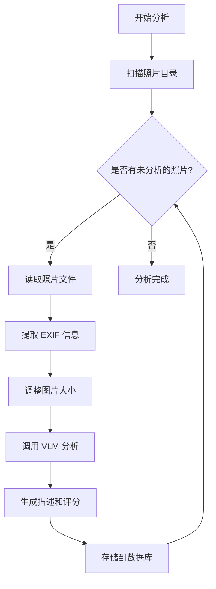
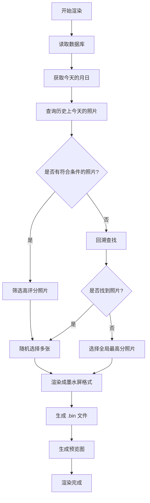
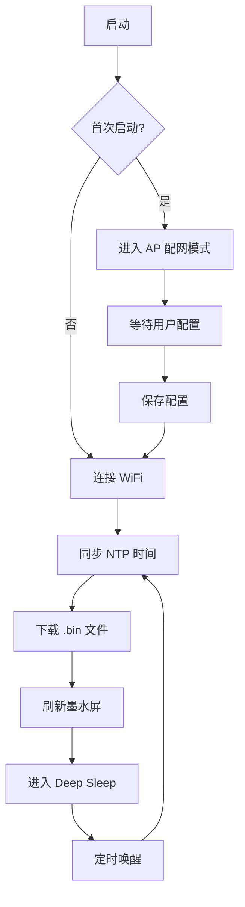
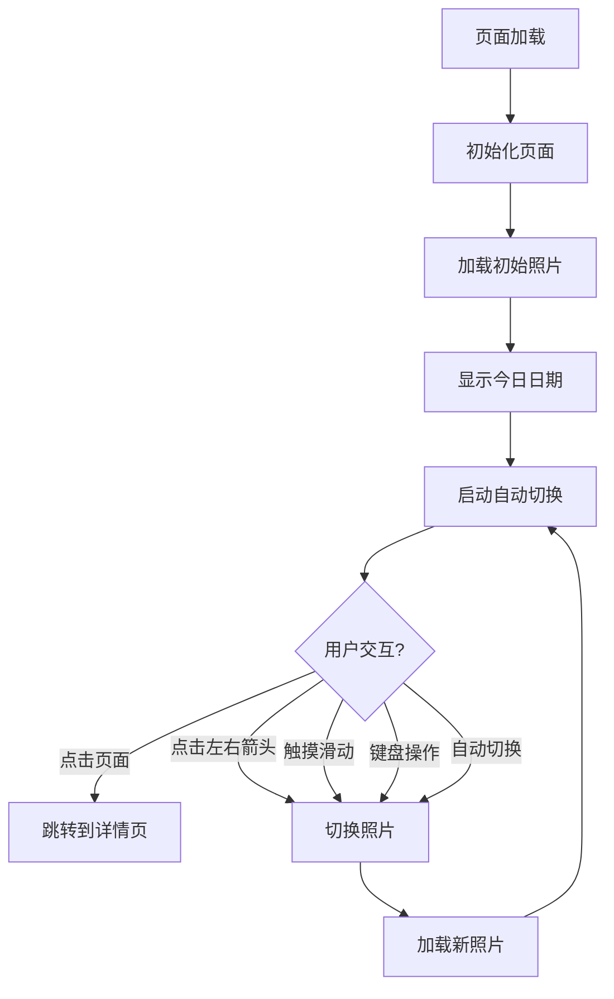
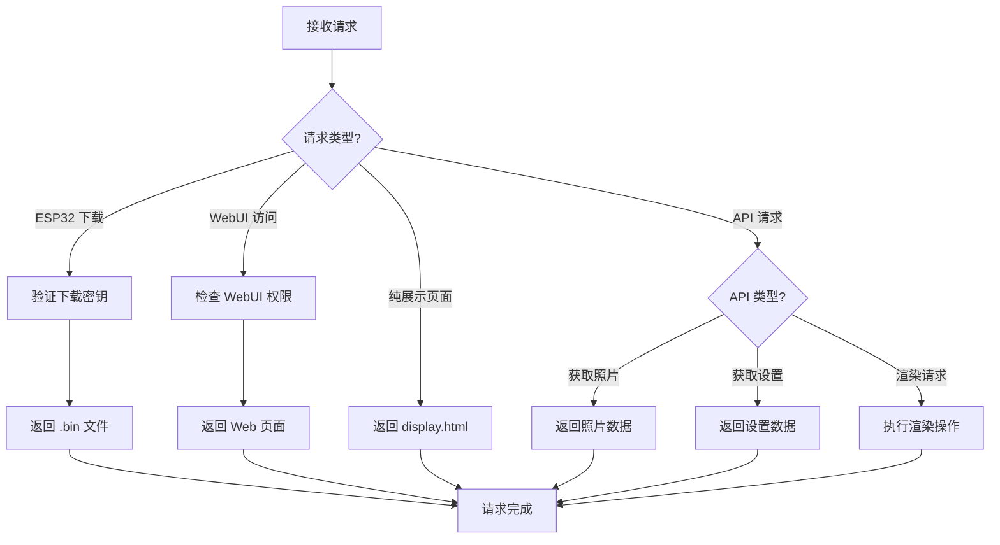
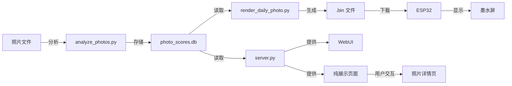

# InkTime 项目架构与流程图

## 1. 项目架构图

### 1.1 整体架构

```
+---------------------------------------------+
|                 InkTime 项目                  |
+---------------------------------------------+
|                                             |
|  +-------------+  +---------------------+  |
|  |  硬件层      |  |  软件层              |  |
|  +-------------+  +---------------------+  |
|  | ESP32-S3    |  |                     |  |
|  | 7.3寸墨水屏  |  |  +---------------+  |  |
|  | 电池系统    |  |  |  照片分析模块  |  |  |
|  +-------------+  |  +---------------+  |  |
|  |  |            |  |  |  analyze_photos.py |  |  |
|  |  |            |  |  +---------------+  |  |
|  |  |            |  |                     |  |
|  |  |            |  |  +---------------+  |  |
|  |  |            |  |  |  图片渲染模块  |  |  |
|  |  |            |  |  +---------------+  |  |
|  |  |            |  |  |  render_daily_photo.py |  |  |
|  |  |            |  |  +---------------+  |  |
|  |  |            |  |                     |  |
|  |  |            |  |  +---------------+  |  |
|  |  |            |  |  |  Web 服务器   |  |  |
|  |  |            |  |  +---------------+  |  |
|  |  |            |  |  |  server.py     |  |  |
|  |  |            |  |  +---------------+  |  |
|  |  |            |  |                     |  |
|  |  |            |  |  +---------------+  |  |
|  |  |            |  |  |  纯展示页面   |  |  |
|  |  |            |  |  +---------------+  |  |
|  |  |            |  |  |  display.html  |  |  |
|  |  |            |  |  |  display.css   |  |  |
|  |  |            |  |  |  display.js    |  |  |
|  |  |            |  |  +---------------+  |  |
|  |  |            |  +---------------------+  |
|  |  |            |                           |
|  |  v            |  +---------------------+  |
|  |               |  |  数据存储层          |  |
|  +---------------+->|                     |  |
|                  |  |  +---------------+  |  |
|                  |  |  |  SQLite 数据库 |  |  |
|                  |  |  +---------------+  |  |
|                  |  |  |  photo_scores.db |  |  |
|                  |  |  +---------------+  |  |
|                  |  |                     |  |
|                  |  |  +---------------+  |  |
|                  |  |  |  文件存储      |  |  |
|                  |  |  +---------------+  |  |
|                  |  |  |  照片目录      |  |  |
|                  |  |  |  输出目录      |  |  |
|                  |  +---------------------+  |
|                                             |
+---------------------------------------------+
```

### 1.2 组件详细说明

| 组件 | 描述 | 核心文件 | 功能 |
|------|------|----------|------|
| **硬件层** | ESP32-S3 开发板、7.3寸四色墨水屏、电池系统 | `ink-display-7C-photo.ino` | 显示照片、低功耗管理、WiFi 连接 |
| **照片分析模块** | 扫描照片、AI 分析、EXIF 提取 | `analyze_photos.py` | 分析照片内容、生成描述和评分 |
| **图片渲染模块** | 选择照片、渲染成墨水屏格式 | `render_daily_photo.py` | 生成适合墨水屏显示的 .bin 文件 |
| **Web 服务器** | Flask 服务器、API 接口 | `server.py` | 提供 ESP32 下载接口、WebUI 管理界面 |
| **纯展示页面** | 前端页面、交互逻辑 | `display.html`, `display.css`, `display.js` | 提供沉浸式照片浏览体验 |
| **数据存储层** | SQLite 数据库、文件存储 | `photo_scores.db` | 存储照片元数据、AI 分析结果 |

## 2. 主要流程图

### 2.1 照片分析流程



### 2.2 图片渲染流程



### 2.3 ESP32 工作流程



### 2.4 纯展示页面流程



### 2.5 Web 服务器请求流程



## 3. 数据流向图



## 4. 系统交互图

### 4.1 组件交互

| 组件 | 交互方式 | 数据传输 | 说明 |
|------|----------|----------|------|
| 照片分析模块 → 数据库 | 写入 | 照片元数据、AI 分析结果 | 存储分析结果 |
| 图片渲染模块 → 数据库 | 读取 | 照片元数据、评分 | 选择要渲染的照片 |
| 图片渲染模块 → 文件系统 | 写入 | .bin 文件、预览图 | 生成墨水屏显示文件 |
| ESP32 → Web 服务器 | HTTP 请求 | 下载 .bin 文件 | 获取要显示的照片 |
| Web 服务器 → 数据库 | 读取 | 照片元数据 | 提供 WebUI 和 API 数据 |
| 纯展示页面 → Web 服务器 | HTTP 请求 | 获取照片数据 | 加载照片和信息 |
| 用户 → 纯展示页面 | 交互 | 点击、滑动、键盘操作 | 控制照片显示 |

### 4.2 数据流

1. **照片输入** → 照片分析模块 → 数据库
2. **数据库** → 图片渲染模块 → 文件系统
3. **文件系统** → Web 服务器 → ESP32
4. **数据库** → Web 服务器 → 纯展示页面
5. **纯展示页面** → 用户交互 → 照片详情页

## 5. 架构特点

1. **模块化设计**：各组件独立工作，职责明确
2. **数据驱动**：基于数据库存储和管理照片信息
3. **多端支持**：同时支持硬件设备和网页端
4. **低功耗设计**：ESP32 深度睡眠，延长电池寿命
5. **AI 增强**：使用视觉大模型理解照片内容
6. **响应式设计**：纯展示页面适配不同设备
7. **可扩展性**：易于添加新功能和支持新设备

## 6. 技术栈

| 类别 | 技术 | 用途 |
|------|------|------|
| 后端 | Python | 照片分析、渲染、Web 服务器 |
| 前端 | HTML, CSS, JavaScript | 纯展示页面、WebUI |
| 框架 | Flask | Web 服务器框架 |
| 前端框架 | Bootstrap 5 | 响应式设计 |
| 图标库 | Font Awesome | 界面图标 |
| 数据库 | SQLite | 存储照片元数据 |
| 嵌入式 | ESP32-S3 | 硬件控制 |
| 屏幕驱动 | GxEPD2 | 墨水屏驱动 |
| AI | 视觉大模型 | 照片内容分析 |

## 7. 部署架构

```
+------------------------+
|  服务器部署             |
+------------------------+
|                        |
|  +------------------+   |
|  |  Python 环境      |   |
|  +------------------+   |
|  |                  |   |
|  |  +------------+  |   |
|  |  |  Flask 服务器 |  |   |
|  |  +------------+  |   |
|  |  |  |  |  |  |  |   |
|  |  v  v  v  v  v  |   |
|  |  +------------+  |   |
|  |  |  API 接口    |  |   |
|  |  +------------+  |   |
|  |                  |   |
|  +------------------+   |
|                        |
|  +------------------+   |
|  |  文件存储         |   |
|  +------------------+   |
|  |  照片目录         |   |
|  |  输出目录         |   |
|  +------------------+   |
|                        |
|  +------------------+   |
|  |  SQLite 数据库    |   |
|  +------------------+   |
|  |  photo_scores.db |   |
|  +------------------+   |
|                        |
+------------------------+
         |
         v
+------------------------+
|  客户端访问             |
+------------------------+
|                        |
|  +------------------+   |
|  |  ESP32 设备        |   |
|  +------------------+   |
|  |  墨水屏显示        |   |
|  +------------------+   |
|                        |
|  +------------------+   |
|  |  浏览器            |   |
|  +------------------+   |
|  |  WebUI 管理界面    |   |
|  |  纯展示页面        |   |
|  +------------------+   |
|                        |
+------------------------+
```

## 8. 总结

InkTime 项目采用了模块化、数据驱动的架构设计，通过 AI 技术实现智能照片选择，同时支持墨水屏硬件和网页端展示。项目架构清晰，各组件职责明确，数据流顺畅，具有良好的可扩展性和可维护性。

通过这个架构，项目实现了从照片分析、渲染到展示的完整流程，为用户提供了两种不同的照片欣赏方式：低功耗的墨水屏硬件和便捷的网页端纯展示页面，满足了不同场景下的使用需求。